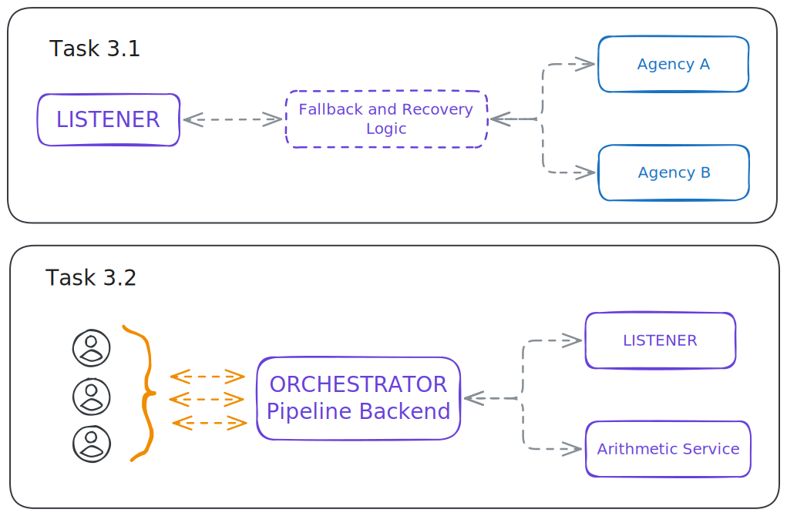
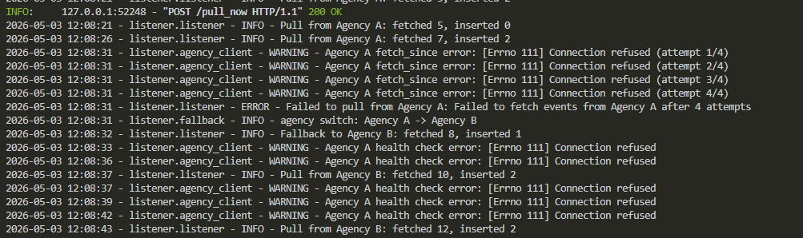
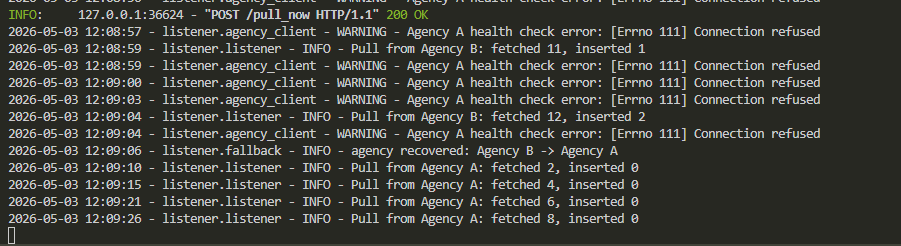
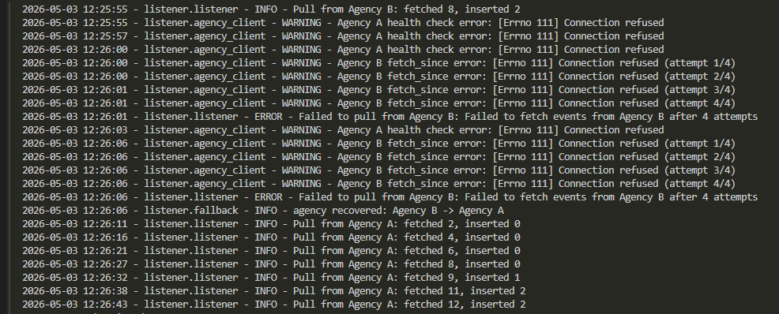

# Design File

This document outlines the decisions and its justifications for the solutions' designs.

## Excercise Selection

Options 2 (Belief State) and 3 (Reasoning & Actuation) were selected.

This combination:
- Involves design judgment
- Involves systems engineering
- Covers four of the agent's functional modules (PERCEPTION, BELIEF, RAP, and ACTUATION)
- Best aligns with personal interests and past experience

**Updated Scope**:

This submission covers Option 2 (both tasks) and Option 3 Task 1 (LISTENER). 

Option 3 Task 2 (multi-tenant orchestrator) was evaluated and removed from the scoped to allow time for focusing on Option 2. 

A high-level idea on how I would have continued with the the orchestrator is sketched in this document, but not implemented.

---

## Option 2. Belief state (conceptual design and implementation choices)

### Context and scope

The two tasks for the BELIEF module (option 2) consist in (1) choosing a way to represent belief, and (2) an update mechanism for such beliefs.

My submission for this specific exercise is scoped as follows (done in sequential order):

- The identification and definition of the [core design principles](../option2_belief/DESIGN_PRINCIPLES.md) to build this solution around.
- [A critique/code review](../option2_belief/APPENDIX_CRITIQUE.md) of the code in the appendix of the [pdf assessment file](../docs/assessment/20260428_candidates-tech-assess_re1-re3.pdf) (also located at [this jupyter file](../docs/assessment/20260428_candidates-tech-assess.ipynb)).
- The documentation of [design choices](#tasks-21-and-22-design-choices) for an alternative, more appropriate implementation of the BELIEF module, which includes what was left out of the design and code example and why.
- An (non exhaustive) [example implementation](../option2_belief/alternative-implementation.ipynb) of such design choices in a jupyter notebook to provide a general idea of what I propose.

### Tasks 2.1 and 2.2 Design Choices

This section aims to define the core design choices with their corresponding justification.
The [DESIGN_PRINCIPLES.md](../option2_belief/DESIGN_PRINCIPLES.md) file is complementary to this section and the decisions build around such principles and the insights obtained during the [code review](../option2_belief/APPENDIX_CRITIQUE.md) of the original proposed [notebook](../docs/assessment/20260428_candidates-tech-assess.ipynb).

#### Classes and Abstractions

From **Principles 1, 2 and 3**:

- Introduce a `BeliefRepresentation` interface, exposing:
  - `mean() -> float`
  - `variance() -> float`
  - `distribution_family() -> str`: e.g. "gaussian", "gamma", "log-normal". The updater needs this to pick the right math.
> Immutable. Updated beliefs are new instances.

- Introduce a `VsIndex` pydantic object addressing a single cell in the grid:
  - `lat: float` (validation for [-90.0, +90.0])
  - `lon: float` (validation for [-180.0, +180.0])
  - `depth: float` (validation for [-10.0, 0.0])
  - `soilsat: float` (validation for [0.0, 1.0])
> soilsat is treated as an index dimension here, noted as technical debt.

- Introduce a `VsMeasurement` pydantic object:
  - `index: VsIndex`
  - `vs: float` (validation for [0.0, 5.0])
  - `sigma: float`: 1-sigma measurement uncertainty in km/s (validation for > 0)
  - `timestamp: datetime` (UTC)
> A measurement is an observation event, not a belief.

- Introduce an `UpdateMechanism` interface, exposing:
  - `apply(prior: BeliefRepresentation, evidence: VsMeasurement) -> BeliefRepresentation`: pure function, returns a new belief.
> Toy implements `PrecisionWeightedGaussianUpdate` and `KalmanUpdate`. Other update mechanisms (Kalman step, log-normal conjugate update, particle filter step) fit the same signature.

#### Concrete Implementations Chosen for the Toy Example

The toy in [the alternative notebook](../option2_belief/alternative-implementation.ipynb) implements `GaussianBelief` as the only `BeliefRepresentation`, and `PrecisionWeightedGaussianUpdate` as the only `UpdateMechanism`. 

Both are chosen because they are the simplest pair that exercises every Protocol method and demonstrates a real Bayesian update. The goal of the toy example is to show an improved pattern for swapping both the representation and update mechanism. For further work, to improve the belief, evaluating the update mechanisms by computing losses would shed some light on what would be the best update mechanism. Naturally, a more sophisticated implementation (such as a kalman filter) would potentially work better, but without evaluation it is difficult to justify such approaches.

#### Store and Concurrency

Introduyce a separate `BeliefStore` class that owns persistence and locking. Its responsibility is: 

- given a region of the grid, return the current belief at that region, accept a new belief to commit back, and ensure no two writers mutate the same region concurrently. 

The lock unit and the storage unit are the same: one chunk per region. so two users updating disjoint regions never fight for the same data. This also allows for multi-user execution. The constraint moves to accessing the same chunk at once. When that happens, 

The store maps continuous `VsIndex` values to a discrete grid using rounding values to a defined step size for each dimension. Step sizes are constructor parameters (defaults: 0.1° for lat/lon, 0.5 for depth, 0.1 for soilsat). The grid cell is the unit of storage and the unit of locking.

### What I Left Out of Scope for this Submission and Why

- soilsat as a belief. Treating it as an index dimension here. Extension: replace `VsIndex.soilsat: float` with a `BeliefRepresentation`, marginalize at lookup.
- Independent updates for each cell is the simplest and appropriate model for this excercise. Modeling dependencies (`rain -> soilsat -> Vs`) as a Probabilistic Graphical Model and propagating updates along the graph would improve the uncertainty treatment (local updates would still use the same `UpdateMechanism` interface)
- Full Zarr backend. Toy uses an in-memory dict. Extension: swap `InMemoryBeliefStore` for `ZarrBeliefStore`, without changing the protocol.
- GPU leverage is left out of scope, but could be useful to improve efficiency through batch updates.
- Learning the `soilsat -> Vs` dependency from data. Requires data we don't have, but could be useful for a more accurate model. We would still depend on evaluation for justification.
- Multi-tenancy. One store per tenant or shared store partitioned by prefix. both fit the existing Protocol.
- round(value / step) is the simplest snap-to-grid for Discretization Scheme for store keys. Other alternatives should be researched for future work, but for the sake of the toy example, the interface uses uniform rounding for clarity.

### (Update/Bonus) Kalman Filter Implementation

Near the end of the assessment, I was left with the idea of pluging in a Kalman Filter to replace the Gaussian Updater. This, as far as I understand, is a good fit for a parallel computation since in its core it performsn matrix multiplication, and it is also considered a standard for dealing with sensor data in uncertain environments.

I wrote [this prompt](../docs/ai_logs/PROMPT-05-05-interfaces.md) to refactor the code since it originally and unnecessarily forced the interface to return mean and variance as `float`, and the kalman filter required a vector for storing means and a covariance matrix. The idea was to improve modularity and to test how a kalman filter implementation would look like. That part of the implementation (commit 581b1f6...) was done by Claude Sonnet 4.6 following such prompt. The conversation can be found in [here](../docs/ai_logs/05-05-refactor.md).

---

## Option 3. Simple Reasoning and Actuation

### Task 3.1. LISTENER: Event Ingestion Module

#### Explicit Requirements Summary 3.1

- Create LISTENER
  - that pulls real time basic seismic data each 'm' minutes (where m is a **positive integer**)
  - that knows and adheres to the signature of seismic events
  - that has automatic fallback and recovery logic when Agency A becomes unavailable
  - that checks type and validity of downloaded data and logs any anomalies
  - if stopped or reinitiated, or switching agencies, does not pull again data already downloded (avoid duplications) -> suggestion is to consider that downloaded timestamp does not mean different event
- Create Simulated APIs (Agency A and Agency B)
  - that makes new data available as new events occur
  - where the timeline of past events (history) is immutable

#### Design 3.1

In this section we move from what is given in the problem to the actual design decisions. Section [architecture](#architecture-decisions-31) contains the actual design decisions, while sections [assumptions](#assumptions-31), [inputs](#identified-inputs-31),  [outputs](#identified-outputs-31), and [failure modes](#failure-modes-31) contain supporting information for those decisions.  

##### Assumptions 3.1

**Event Timestamp**: It may be unreasonable to think that a specific event ID is shared between agency A and B, and thus we assume it is not necessarily the case. We treat that case (e.i., when switching between agencies) as out of scope. This is noted as external limitation.

**Agency API Endpoints**: These are not given, but we assume that it is reasonable for such a service to expose at least the following endpoints:
- `get_recent_events`: to get the events from a given timewindow -> returns JSON payload with a list of objects of type seismic event
- `get_event_by_eid` to get an event by its event ID (`eid`) -> returns JSON payload with seismic event signature/schema

##### Identified Inputs 3.1

1. Configuration (startup):
   - value of 'm'
   - external services (API) list (id + url)
   - (optional, operative) timeouts, max retries, etc. 
2. Triggers (runtime) 
   - Internal timer to fire polling
   - External endpoint to "pull now" (for Task 2) -> should be independent from internal timer and not break it

##### Identified Outputs 3.1

1. Persisted (database) validated and deduplicated data from events
2. Logs to trace annomalies and debug

##### Failure Modes 3.1

**Startup**
- missing dependencies and similar errors -> mitigated by following instalation and running from README, using good practices (e.g., requirements.txt)
- wrong configuration (levels: structure and values)
  - config fields match expected schema
  - 'm' is positive integer
  - JSON schema (seismic event signature) path is reachable and parsable
- storage path unreachable (e.g., SQLite cannot be opened) -> fail fast at startup with a clear error.

**Communication with APIs (agencies)**
- agency A API Unavailable -> mitigated with fallback and recovery logic (periodic health checks to know when to switch back)
- both Agency A and B APIs unavailable -> LISTENER should stay alive and retry. Somehow inform status as `unhealthy`. Pull now button from orchestrator should return detailed error and avoid hanging.
- single request timeout per agency call -> log error and try for `max_retries`. Trigger protocols explained in previous two points. 
- agencies taking too long to respond -> if no successful pull from any agency has happened in N minutes, the system is no longer in a healthy state.

**Data Validation**
- incomming data does not adhere to seismic event signature -> record rejected in persistance, log anomaly, continue.
- same event from different agencies recorded since we cannot guarantee `eid` equivalence -> OUT OF SCOPE

**Storage and State**
- DB write failure -> log warning and retry, log anomaly (error) if still failing
- restart or stop while pulling and event not persisted -> mostly handled by lookback window, if restart or stop, the next pull will take previous events. A more robust was considered and left out of scope for the demo, it was added to technical debt.

**Asynchronicity and Concurrency**
- LISTENER serves two trigger sources: an internal timer (every `m` minutes) and a "pull now" endpoint callable by the orchestrator on behalf of multiple tenants. Concurrent triggers risk redundant agency calls and duplicate inserts. -> mitigated by short-circuit when pull in progress AND idempotency (e.g., `INSERT OR IGNORE ON eid`)

##### Architecture Decisions 3.1

**Configuration**
- Configurable to what extent? -> As simple as possible. Pydantic validation. YAML for configuration for readability.

**Logging**
- How to log? -> Shared log system for consistency, log writing practices documented in DEVS.md to avoid "over-logging" and keep consistency.
- Where to log? -> For now, simply log in console. Log configuration is out of the scope of this demo.

**Data Validation**
- Pydantic vs JSON schema for data validation (when respond recieved from agencies)? -> The seismic event contract is defined as a Pydantic model (SeismicEvent), which serves as the single source of truth for validation, type-safe domain objects.

**Persistance**
- Use ORM or not? -> avoid using it. it could help for future portability, but we loose siplicity. notes as technical debt.
- Which database to use? -> SQLite, since we start simple, we stick with light tool that runs locally and has low setup cost

**Host Agency Services**
- How and where to host Agency services? -> standalone with FastAPI running on separate ports (8001 and 8002), reachable through REST locally.

**Agency Switching**
- What are the rules for switching?
  - if agency A unavailable, switch to Agency B
  - periodically send checks to Agency A to test availability
  - when A available again, recover

**Agency API**
- What enpoints could it potentially have?
  - `GET /events?since=<timestamp>`: to get a list of events in a timewindow (e.g. `?since=<timestamp>`) -> returns JSON payload with list of objects of type seismic event
  - `GET /health`: to query for availability
- How to ask for the data from LISTENER? -> each pull queries a fixed lookback window wider than m, overlap is harmless thanks to dedup.

**Deduplication**
- How to avoid duplication? -> Use `eid` to differentiate events and avoid duplication.

**Mitigate Concurrency Risks**
- How to deal with asynchronicity and deduplication from multi-tenant calling orchestration at same time? -> asyncio.Lock for short-circuit, SQLite UNIQUE constraint on eid with INSERT OR IGNORE for persistence-level idempotency.

**Demo Design**
- How to show functionality? -> Makefile starts the demo from a single entry point, where the agencies and the listener are spun, and in terminal we can see logs. On another terminal we can control agencies by intrudcing specific targets to the makefile to stop and run each of the agencies independently for demo purposes (`stop_agency_a`, `start_agency_a`, `stop_agency_b`, `start_agency_b`). This will help show during the demo the fallback functionality. For visualization, when agency switch events and recovery events happen, log at INFO with a recognizable marker (e.g. `agency switch: A -> B`, `agency recovered: A`)

#### Technical Debt / Future Work 3.1

- health check of service (e.g., heartbeat) -> not core functionality, always a good practice for service orchestration but out of scope
- event-driven notification system for anomalies (complementary to logs) -> would be a good feature but are out of scope
- use of sqlite3 and not using an ORM creates a potential risk for future migration and refactoring, but we accept this to gain simplicity for this assessment
- to tag event ID as not persisted. when startup, fetch that list to ask service by ID

#### Evidence of Running Demo for Task 3.1

The demo [(see README to run)](../README.md/#run) was tested locally in a Windows 11 machine using WSL2 with Ubuntu 22.04 [(read the Tools section for more information)](../README.md/#tools-and-technologies), with Makefile and python+[dependencies](../README.md/#install) installed correctly.

The following images showcase these runs:

### Task 3.2. Multi-tenant pipeline for reasoning and actuation

This task was removed from the scope of the implementation. A high-level sketch of the intended approach is shown below:

**Architecture**

FastAPI orchestrator with a single `POST /run` endpoint, accepting a `tenant_id` header and a payload describing the action. A `Router` inspects the payload and routes to one of two pipelines asynchronously. For consistency and simplicity, it would match the LISTENER's concurrency model.

**Two pipelines**

1. **LISTENER pull-now**: triggers an immediate pull via LISTENER's "pull-now" endpoint and returns the events.
2. **Arithmetic service**: separate python process that consists of a service that calculates predefined math operations with floting point values of arbitrary precision, with stdout returned to the orchestrator. Process chaining: pipeline (1)'s output can feed pipeline (2).

**Multi-tenancy and timing**

`tenant_id` is carried through the call stack and tagged on logs and storage. Per-tenant rate limiting gates access to the LISTENER pull pipeline. Each response exposes `execution_time_ms` (CPU work) and `wall_clock_ms` (total elapsed). When comparing these two, we would test and verify that the backend is functioning correctly in a.

For storage, I would use a shared database for the demo as it is simpler, for all tenants. This would be noted as technical debt for the case where certain tenants need their own database.

**Error handling**

- *Subprocess timeouts* The arithmetic service can hang or take too long. The orchestrator enforces a deadline for each call. If expired, it kills the subprocess, logs the event, and returns a `timeout` error to the caller.
- *Downstream unavailability* The LISTENER pull pipeline depends on LISTENER being reachable. If it isn't, the orchestrator does not retry indefinitely. Instead it returns a `downstream_unavailable` error so the tenant gets the detail of the error instead of a hanging request.
- *Wrong input* Requests that don't match the expected schema are rejected as fail fast (Pydantic validation) with a `bad_request` error, before any pipeline is invoked.

In all three cases, the orchestrator returns with a structured error response and saves the failure context in logs for debugging.